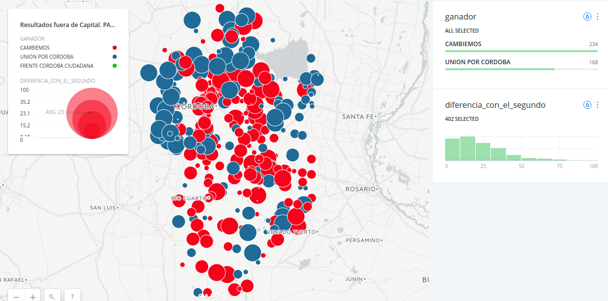
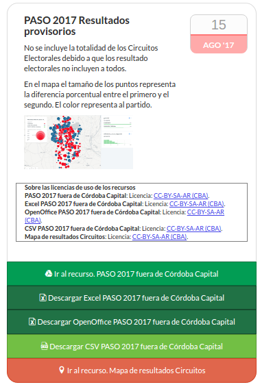

### Análisis por Circuitos electorales

Los circuitos electorales en general son ciudades de la Provincia de Córdoba.
El análisis de los circuitos se hace con un [script python](analizar-circuitos.py).  

Luego de analizados los datos se puede construir un mapa

Además los datos quedan disponibles en el portal de Gobierno Abierto [VER](https://gobiernoabierto.cordoba.gob.ar/data/datos-abiertos/categoria/sociedad/elecciones-a-diputados-nacionales-en-cordoba-fuera-de-capital/224).  

